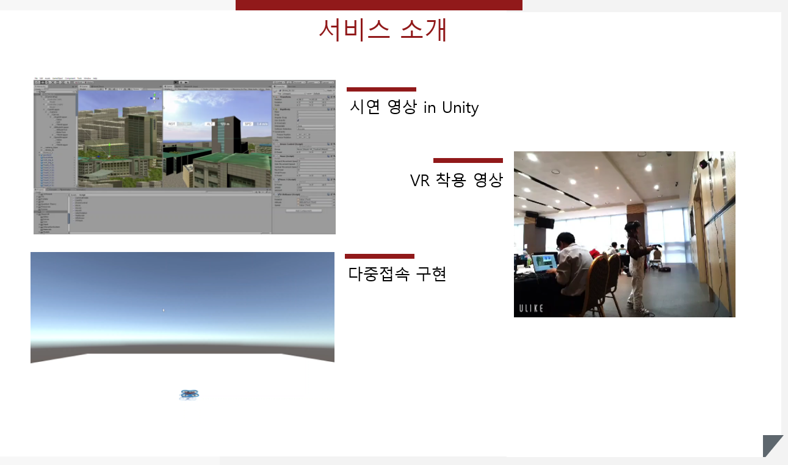
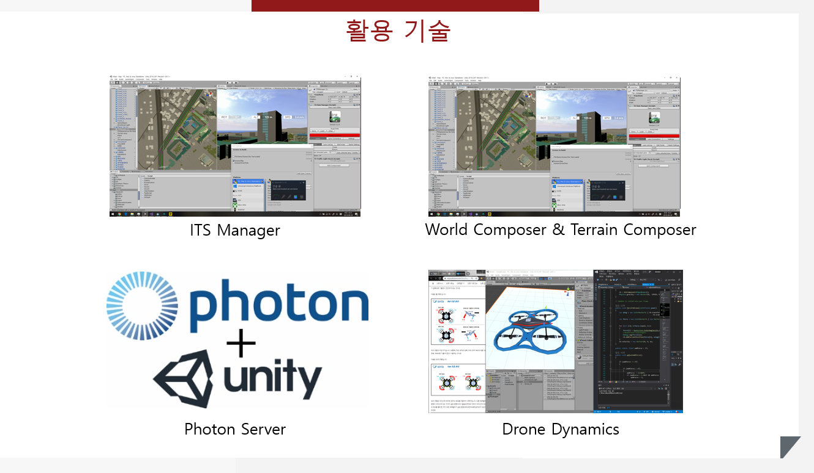

# InhaVRPortal

  

**2019 Inha Hackathon 대상 수상작 :1st_place_medal:**

InhaVRPortal은 인하대학교와 그 주변을 배경으로 한 가상현실 속에서 드론을 띄워 조종하는 시뮬레이터입니다.

# 1. 소개

오늘날 들어 무인 항공기, 즉 드론에 대한 관심이 꾸준히 증가하는 추세에 있습니다. 사람이 타지 않아도 되는 드론은 기존의 항공기에 비해 몸체가 작고 기동이 날렵하여 산업용 및 군용으로 다양하게 사용됩니다. 심지어 최근에는 드론 자격증까지 생겼다고 하니, 드론에 대한 관심을 느끼실 수 있나요?

하지만 드론에 관심이 생겨 실제로 드론을 띄우고 싶으시다면, 특히 우리나라에서는 그 조건이 상당히 까다로운 편입니다. 드론을 통해 항공에서 촬영을 하고자 하면, 비행금지구역 및 비행제한구역을 피해서 띄워야 합니다. 야간에는 띄우지 못하며, 150m 이상의 고고도 비행 역시 금지입니다. 이러한 까다로운 규정들 때문에, 일반적으로 도심에서는 드론을 띄우기 매우 어려운 현실입니다.

InhaVRPortal은 이러한 점에 착안하여, 

> **가상현실 속에서 드론을 사용자가 원하는대로 조종하면 어떨까?**

라는 아이디어에서 시작한 프로젝트입니다. 본 프로젝트는 인하대학교와 그 근방을 구현한 맵상에서 사용자가 드론을 띄울 수 있게 합니다. 사용자는 VR을 착용하여 드론의 시점에서 드론을 움직이게 됩니다. 또한 드론의 현실적인 움직임을 위해 유니티 3D 엔진의 물리 엔진을 적용했습니다.

# 2. 기술적 요소

본 프로젝트는 다음과 같은 기술적 요소들을 사용하였습니다.

## 2.1. Unity 

개발환경은 Unity 엔진을 사용했습니다. Unity 엔진을 통해 현실감 넘치는 맵을 구현하고, 물리 엔진을 적용하였으며 VR 기기를 연결하여 사용하였습니다.

### 2.1.1. 맵 구현

실제 인하대학교와 비슷한 맵을 구현하기 위해, Unity의 에셋들을 활용하여 다음과 같은 작업들을 수행했습니다. 단, 모델링의 경우 외부 프로그램을 사용하여 직접 제작하거나 타 모델 공유 사이트에서 수집하였습니다.
* 실제 인하대학교 주변의 지형 데이터를 추출 후 높이맵(heightmap)으로 변환
* 해당 높이맵을 지형(terrain) 오브젝트로 변환
* 변환된 지형 오브젝트에 환경(environment)을 구성 e. g. 초목, 텍스쳐 등
* 실제 건물이 존재하는 위치에 건물 3D 모델을 구성
* 실제 도로가 존재하는 위치에 도로를 구성

### 2.1.2. 물리 엔진 적용

현실적인 드론 조작을 위해, 유니티에서 제공하는 물리 엔진을 사용했습니다. 드론에는 질량과 저항력이 적용되어, 사용자의 조작에 관여합니다. 드론을 조작 시 출력(thrust)를 높여 드론의 4개의 날개에 힘 벡터를 가하고, 드론을 좌우로 기울일 때는 2개의 날개에 가해지는 힘 벡터를 줄여 구현했습니다.

## 2.2. VR기기

저희는 본 프로젝트가 단순한 현실감을 넘어서, 사용자가 드론 조작에 몰입하는 것을 원했습니다. 이를 위해 방안을 물색한 결과 VR기기의 사용이 우리의 목적과 부합함을 발견했고, 프로젝트에 적용했습니다.

 VR 기기는 HTC Vive를 사용하였습니다. 사용자는 기본적으로 키보드를 통해 조작할 수 있으며 또한 Vive의 컨트롤러를 사용하여 조작할 수도 있습니다. 컨트롤러를 통한 조작은 HTC의 지원 프로그램과 Unity와의 연동을 통해 구현했습니다.

###### Written by challenger71498
